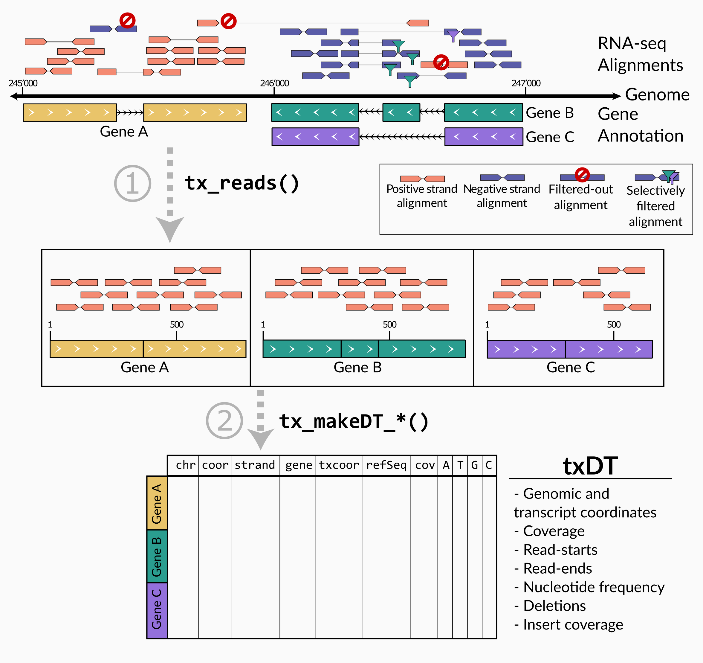
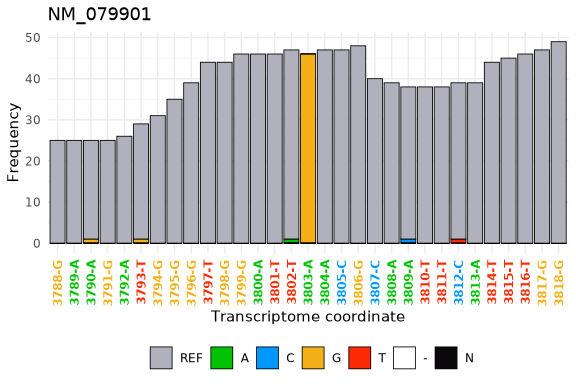

# txtools <a href=''></a>

<!-- badges: start -->

[](https://github.com/AngelCampos/txtools)
<!-- badges: end -->

## Description

**txtools** is a package that processes RNA-seq reads alignments into
transcriptomic-oriented tables. Enabling a quick and simplified
analysis, to closely inspect summarized RNA-seq data per transcript, at
nucleotide resolution, i.e. coverage, read-starts, read-ends, deletions,
and nucleotide frequency. Attractive plotting is also readily available
to visualize data.



## Installation

You can install the development version from
[GitHub](https://github.com/AngelCampos/txtools) typing in the following
commands in the R console:

``` r
if (!requireNamespace("remotes", quietly = TRUE))
    install.packages("remotes")
remotes::install_github("AngelCampos/txtools", build_vignettes = TRUE)
```

## Quick example

In this small example we will use the ‘Pasilla’ experiment data (from
its own package) which contains a BAM file for the paired-end alignments
of a *D. melanogaster* RNA-seq experiment on chromosome 4, along with a
FASTA file comprising the genome sequence for the same chromosome.

Using txtools we can load the **genome** (FASTA), the **gene
annotation** (BED-12), and the **RNA-seq reads alignment** (BAM) files
into R with ease.

``` r
# Load packages
library(txtools)
library(pasillaBamSubset)

# Getting paths to files
BED_file <- tx_dm3_geneAnnot()
FASTA_file <- dm3_chr4()
PE_BAM_file <- untreated3_chr4()

# Loading D. melanogaster gene annotation, genome, and paired-end bam alignments
dm3_geneAnnot <- tx_load_bed(BED_file)
dm3_genome <- tx_load_genome(FASTA_file)
dm3_PEreads <- tx_load_bam(file = PE_BAM_file, pairedEnd = TRUE, loadSeq = TRUE)
```

First, we process the alignments to their transcriptomic versions using
the `tx_reads()` function.

``` r
reads_SE <- tx_reads(reads = dm3_PEreads, 
                     geneAnnot = dm3_geneAnnot, 
                     withSeq = TRUE, 
                     nCores = 1, 
                     minReads = 1)
#> Processing 75409 reads, using 10 gene models. 
#> 10373 alignments overlap 10 gene models 
#> Assigning alignments to gene model... 
#> Processing sequences. This may take several minutes depending on geneAnnot size ... 
#> Output contains: 7214 unique alignments in 10 gene models
#> Warning in tx_reads(reads = dm3_PEreads, geneAnnot = dm3_geneAnnot, withSeq =
#> TRUE, : Some alignments were not assigned to any gene, you can retrieve them
#> using the tx_getUnassignedAlignments() function.
```

Then we just need to summarize the alignments into a DT. In this case
using the `tx_makeDT_covNucFreq()` function outputs a table with all the
base metrics, including read coverage (‘cov’ column), and nucleotide
frequency (A,C,T,G columns).

``` r
DT <- tx_makeDT_covNucFreq(reads_SE, geneAnnot = dm3_geneAnnot, genome = dm3_genome)
```

The resulting DT comprise all summarized information from the RNA-seq
reads aligned to the genome and contained within the genes in the gene
annotation (this example consists of only the top 10 expressed genes).
For more information on the columns of DT consult the
`tx_makeDT_covNucFreq()` documentation.

To extend the base metrics that the `tx_makeDT_*()` functions provide
txtools provides the `tx_add_*()` functions family. One example of such
functions is `tx_add_diffNucToRefRatio()` which calculates the ratio of
nucleotide counts different to the reference sequence. Using these
metric we can easily spot locations in which RNA transcripts sequence is
different from that of the reference sequence.

``` r
DT <- tx_add_misincRate(DT, addMisinandTotalCols = TRUE)
DT[which(misincRate > 0.5 & nucTotal > 40),]
#>     chr gencoor strand      gene txcoor refSeq cov start_5p end_3p A C  G T N -
#> 1: chr4  939355      - NM_079901   3803      A  90        0      0 0 0 46 0 0 0
#>     . misincCount nucTotal misincRate
#> 1: 44          46       46          1
```

Finally, using the `tx_plot_nucFreq()` function we can visualize that
data in the DT at an specific location.

``` r
tx_plot_nucFreq(DT, gene = "NM_079901", txRange = window_around(3803, 15))
```

<!-- -->

## Further documentation

## Current limitations:

-   Insertions: txtools is not able to deal with insertions. This is
    mainly because insertions are not part of the original
    trasncriptomic nor genomic reference space as they would alter the
    length of the gene model. This could be an added feature in future
    versions but is not a priority.

-   Potentially long processing times: Loading big BAM files into R
    commonly requires a lot of time, having this in mind txtools
    provides a progress bar to keep users informed about the loading
    status. Most importantly, depending on the ammount of both loaded
    reads and the size of the *Gene Annotation* tx_reads() processing
    time can take several minutes. A solution to this issue is the use
    of multi-threadding which has been incorporated into tx_reads() and
    other functions, but such functionality is only available for UNIX
    and MAC OS.

## Additional notes:

-   As many R packages meant for high-throughput data analysis and
    manipulation, using ***txtools*** may require high ammounts of RAM
    memory, depending mainly on the size of BAM files being processed.
